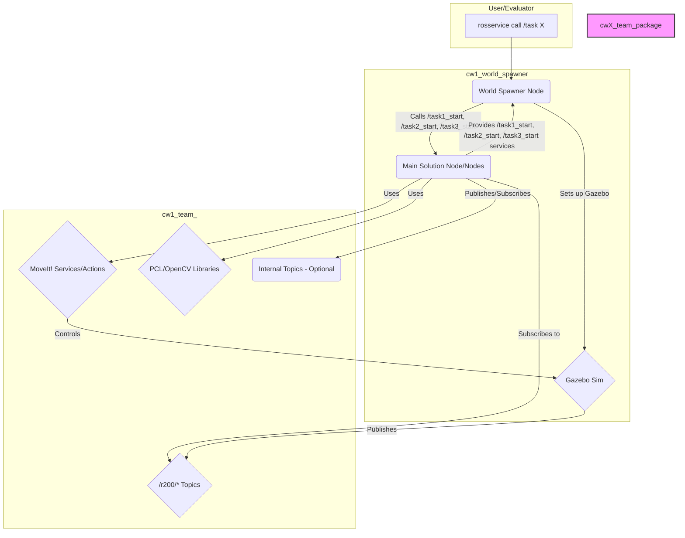

# System Patterns: COMP0250 Coursework 1 (CW1)

## High-Level Architecture

The proposed solution follows a modular ROS-based architecture centered around one or more core nodes within the `cw1_team_<team_number>` package. Coursework 2 is out of scope.

## Core Components & Patterns

1.  **Main Solution Node(s):**
    *   **Responsibility:** Acts as the central coordinator. Provides the `/task1_start`, `/task2_start`, `/task3_start` ROS services for CW1. Receives task parameters, orchestrates perception and manipulation, and returns the service response.
    *   **Pattern:** Could be a single monolithic node or potentially split into specialized nodes (e.g., Perception Node, Manipulation Node) communicating via internal topics or actions if complexity warrants. A single node is likely sufficient initially.
    *   **State Management:** A state machine pattern within the main node could manage the flow of each task (e.g., IDLE -> PERCEIVING -> PLANNING_PICK -> EXECUTING_PICK -> PLANNING_PLACE -> EXECUTING_PLACE -> COMPLETING_SERVICE -> IDLE).

2.  **Perception Pipeline:**
    *   **Input:** Subscribes to relevant `/r200/*` topics (e.g., `depth/points`, `color/image_raw`).
    *   **Processing:**
        *   **PCL:** Point cloud filtering (voxel grid, passthrough), segmentation (planar segmentation for table, Euclidean clustering for objects), feature extraction (color).
        *   **OpenCV:** Potentially used for color detection on registered 2D images or refining PCL results.
    *   **Output:** Object poses (`geometry_msgs/PoseStamped`), colors (`std_msgs/String`).
    *   **Pattern:** A sequential processing pipeline, likely implemented as a series of functions or a dedicated class within the main node or a separate perception node.

3.  **Manipulation Pipeline:**
    *   **Input:** Target poses for picking and placing, object dimensions/shape for grasp planning.
    *   **Planning:** Uses MoveIt! (likely via the `move_group_interface` in C++ or `MoveGroupCommander` in Python) to:
        *   Set planning scene obstacles (detected objects, table).
        *   Plan trajectories to pre-grasp, grasp, lift, transport, pre-place, place, and retreat poses.
        *   Handle gripper actions (open/close).
    *   **Execution:** Executes planned trajectories via MoveIt!.
    *   **Pattern:** Utilizes MoveIt!'s planning and execution capabilities. Requires careful definition of target poses (e.g., grasp pose relative to object centroid, place pose within basket). Collision avoidance is handled primarily by MoveIt! based on the provided planning scene.

4.  **Service-Based Interaction:**
    *   The core interaction model is defined by ROS services (`/task1_start`, `/task2_start`, `/task3_start`). The solution node acts as a service server for these CW1 tasks.
    *   This enforces a request-response pattern for each task.

## Potential Refinements

*   **Abstraction:** Create C++ classes or Python modules to encapsulate perception logic (e.g., `ObjectDetector`, `ColorIdentifier`) and manipulation actions (e.g., `PickAndPlacer`).
*   **Error Handling:** Implement robust error handling for service calls, perception failures (object not found), and MoveIt! planning/execution failures.
*   **Configuration:** Use ROS parameters for tunable values (e.g., PCL filter parameters, grasp offsets, color thresholds).

## Current Focus (CW1 Robustness & Task 3)

*   **Robustness:** Investigate and fix initialization crashes for Task 1 & 2 service handlers. Potential areas: timing of MoveIt!/PCL setup, resource loading, exception handling.
*   **Task 3 Implementation:**
    *   Enhance perception pipeline to detect multiple boxes and baskets and determine their colors.
    *   Develop logic to match boxes to baskets of the same color.
    *   Implement multi-step pick-and-place sequence within the `/task3_start` service handler.
    *   Ensure collision avoidance with the planning scene (table, other objects).
